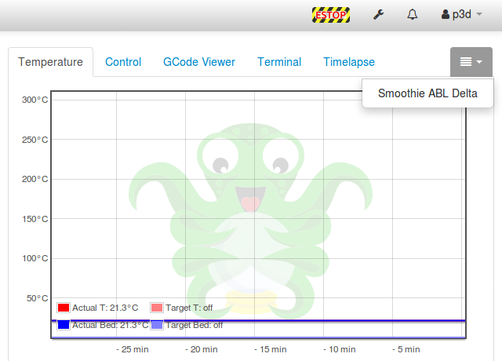
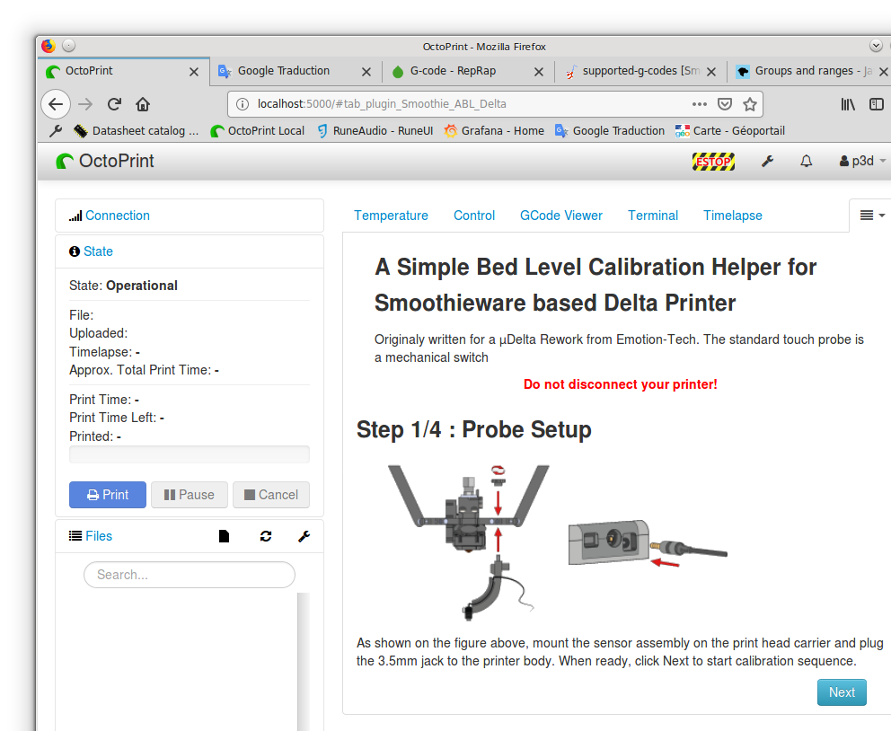
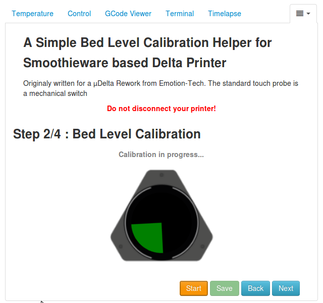
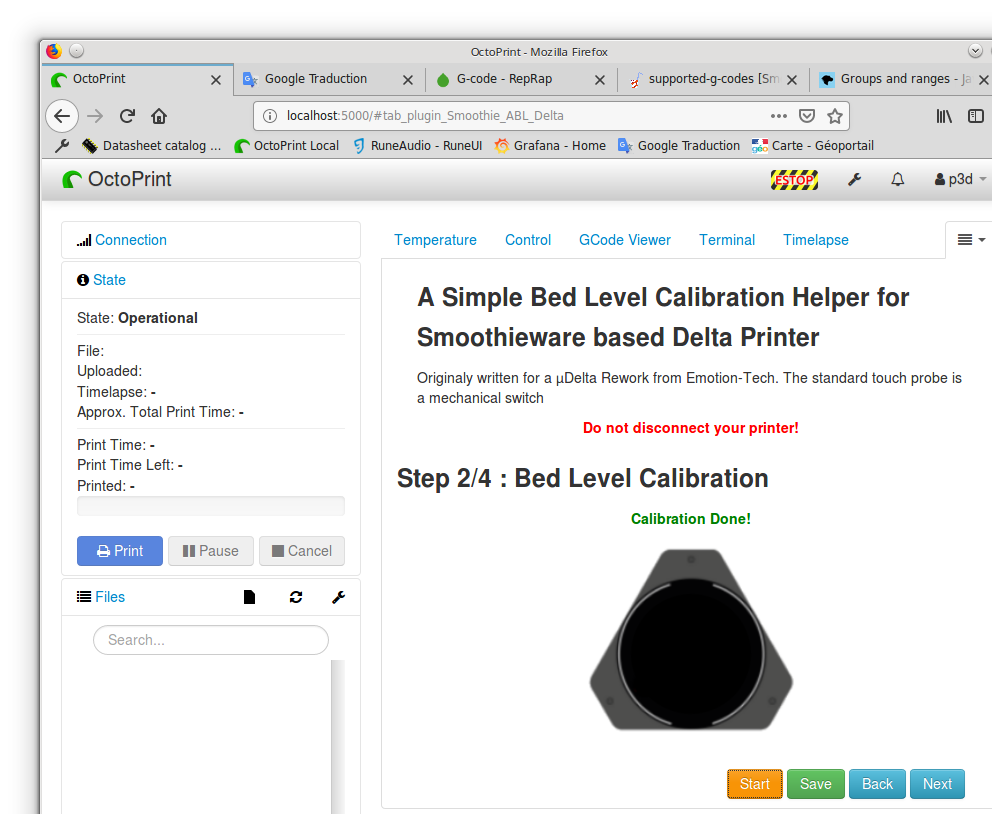
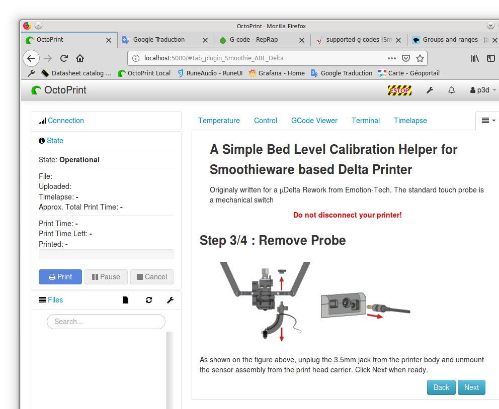
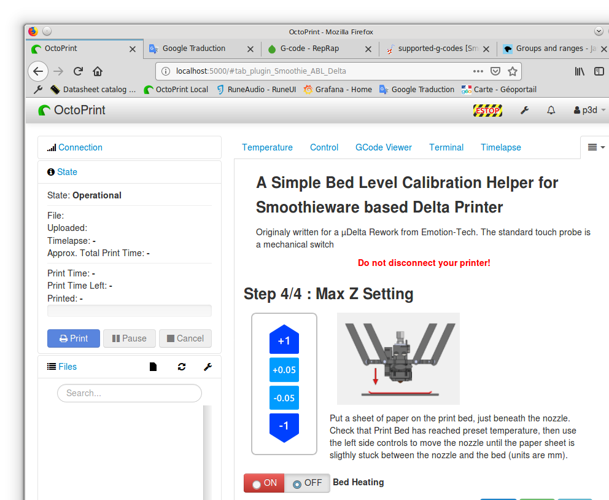

# OctoPrint-Smoothie-abl-delta
## A simple OctoPrint plugin to ease µDelta Rework Calibration.
It will handle Bed Level grid Calibration and Max Z settings \
(almost) automatically. 

## Setup

Install via the bundled [Plugin Manager](https://github.com/foosel/OctoPrint/wiki/Plugin:-Plugin-Manager)
or manually using this URL:

    https://github.com/drone-labs/OctoPrint-Smoothie-abl-delta/archive/master.zip

**TODO:** Describe how to install your plugin, if more needs to be done than just installing it via pip or through
the plugin manager.

## Configuration

**TODO:** Describe your plugin's configuration options (if any).

## Usage

A 2-cell LIPO Battery can be used to power the Board. The Battery balancing plug has
to be plugged into the JST-XH **LIPO** header. **Check this point before buying**
(Connector type and wiring diagram).
Charging logic and protections are handled by the hardware. Monitoring the status Leds
(BATT_LED_1 to BATT_LED_4) has to be done by software. Below is a simplified diagram
of the BeagleBone Blue power distribution circuit (USB not shown):

A 2-cell LIPO Battery can be used to power the Board. The Battery balancing plug has
to be plugged into the JST-XH **LIPO** header. **Check this point before buying**
(Connector type and wiring diagram).
Charging logic and protections are handled by the hardware. Monitoring the status Leds
(BATT_LED_1 to BATT_LED_4) has to be done by software. Below is a simplified diagram
of the BeagleBone Blue power distribution circuit (USB not shown):

