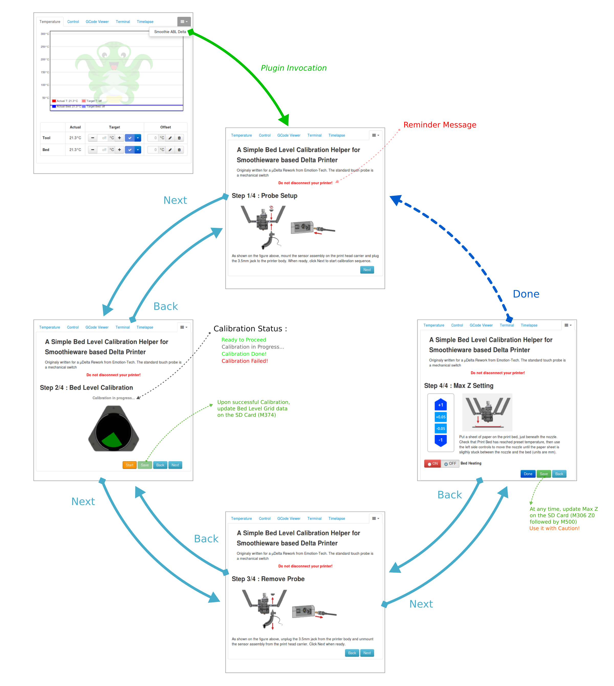

# OctoPrint-Smoothie-abl-delta
## A simple OctoPrint plugin to ease µDelta Rework Calibration.
It will handle Bed Level grid Calibration and Max Z settings (almost) automatically. 

## Setup

Install via the bundled [Plugin Manager](https://github.com/foosel/OctoPrint/wiki/Plugin:-Plugin-Manager)
or manually using this URL:

    https://github.com/drone-labs/OctoPrint-Smoothie-abl-delta/archive/master.zip

## Configuration

**TODO:** Describe your plugin's configuration options (if any).

## Usage

<!-- html comment are not escaped... -->
The diagram below highlights the Plugin Navigation Loop :

## Known Bugs

## ToDo

