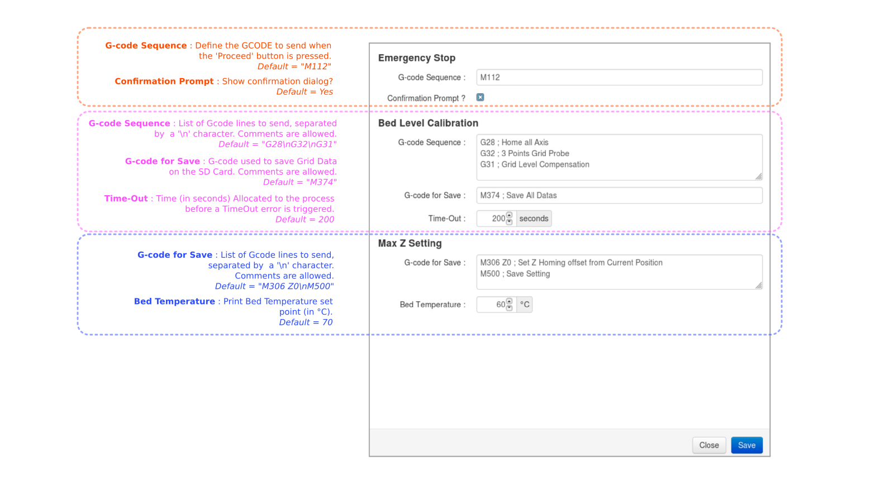

# OctoPrint-Smoothie-abl-delta
## A simple OctoPrint plugin to ease µDelta Rework Calibration.
It will handle Bed Level grid Calibration and Max Z settings (almost) automatically. 
Also included is an Emergency Stop Feature largely inspired by the work of Sébastien
Clément. 

## Credits
https://github.com/Sebclem/OctoPrint-SimpleEmergencyStop 
https://github.com/scottrini/OctoPrint-PrusaLevelingguide

## Setup

For now, Install manually using this URL:

    https://github.com/drone-labs/OctoPrint-Smoothie-abl-delta/archive/master.zip

## Configuration

## Usage

<!-- html comment are not escaped... -->
The diagram below highlights the Plugin Navigation Loop :

## Known Bugs

- **Bed Temperature**

    For now, Bed Heating is assumed to be turned OFF when entering the Plugin;
    This is not 100% guaranteed and Jog is enabled whatever the Bed Temperature...
    
    An idea : Read the Temperatures (M105) and compare the current value against
    the setting.
    -Setting = 0 : Heating is OFF
    -Current value is less than setting : Disable Jog
    -Current value equal or greater than setting : Enable Jog
    
## ToDo

